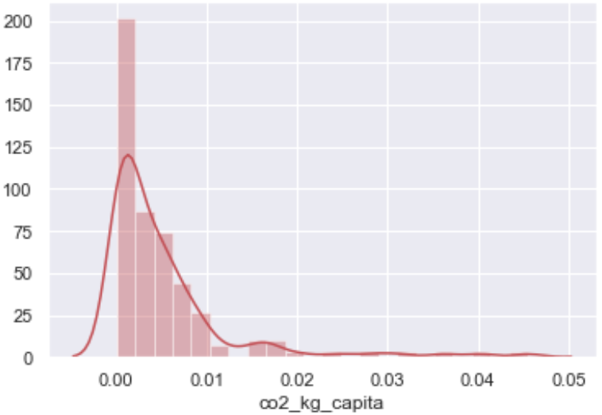
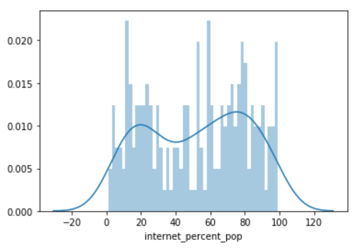

# Political-Emissions-Modeling-

This project attempts to quantify the effect of World Bank political and socioeconomic variables on country CO2 emissions and internet access using linear regression. 

## Tech Stack 

- Python
- Pandas 
- StatsModels
- Matplotlib
- Seaborn 
- MySQL Workbench
- AWS 

## Data  

For modeling we used a collection of World Bank and United Nations excel and csv files downloaded from official websites. Data was cleaned, countries with missing or unreliable estimates were dropped and continuous data was normalized.  

## Model 1 - Predicting CO2 Emissions

The purpose of building this model was to learn whether carbon dioxide emissions per capita could be estimated using political variables, such as governance quality and political stability. 

Target variable distribution, CO2 emissions per capita by country, shows a non-normal distribution. 

After checking for collinearity among feature variables, we selected the following features for the final model:
- Political Stability 
- Government Accountability 
- Rule of Law 
- Percent of GDP attributed to agriculture and forestry (log normalized)
- Percent of national income attributed to natural resources (log normalized) 

The r-squared value for this model is .192, suggesting political variables explain little variance when it comes to CO2 emissions per capita. 

## Model 2 - Predicing Internet Usage 

The purpose of building this model was to identify the strongest socioeconomic predictors of national Internet usage as a percent of the total population.  

Target variable distribution, percent of population using Internet, shows a relatively normal distribution. 

After checking for collinearity among feature variables and investigating variance inflation factors, we selected the following features for the final model:
- GDP per capita 
- Government Accountability 
- Cost of conducting business

The r-squared value for this model is .792, suggesting these features - especially GDP per capita - explain most of the variance in country population Internet usage. 

## Conclusion 

The results of Model 1 show that most of the variance in country CO2 emissions are related to economic development and wealth, not political stability or government structure. Model 2 succeeded in accurately predicting levels of internet access among country populations, but GDP per capita proved to be the most predictive variable - by far. Overall, it is very hard to distinguish whether political and cultural variables impact emissions or Internet access because energy consumption and technology adoption are so strongly correlated with GDP. 

These models exclusively used data from 2016. Both could be improved by adding years and increasing the sample size. 

For additional context on the thought process and literature that inspired this research, check out this [blog post.](https://medium.com/swlh/what-will-the-energy-transition-actually-require-cee8d3feb7f5) 

